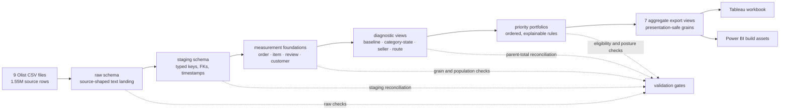
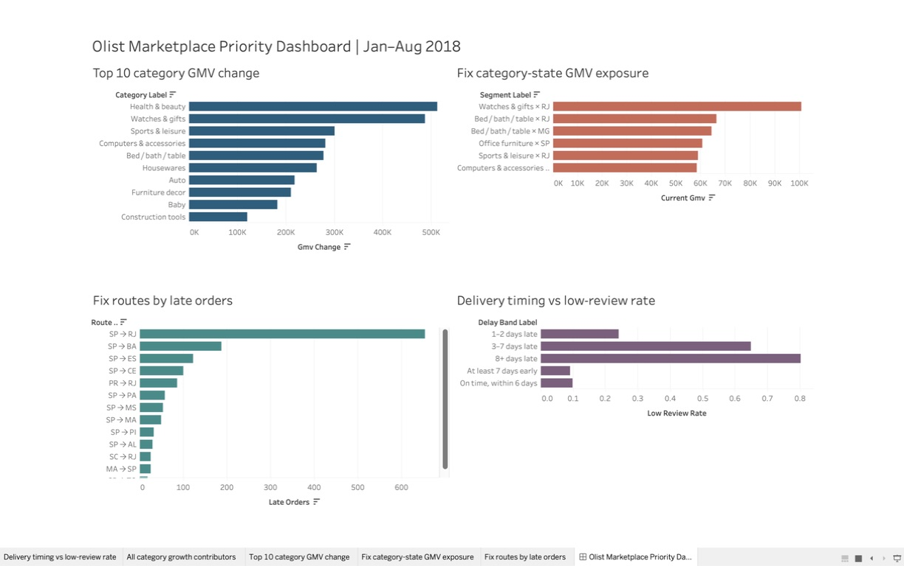
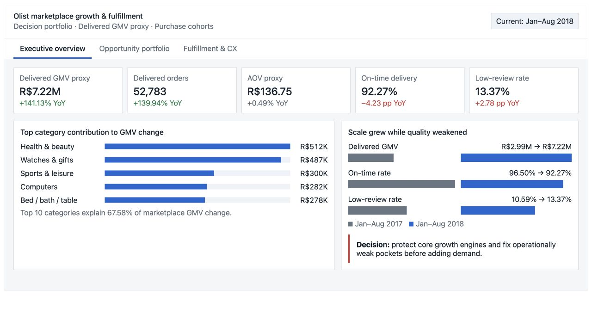
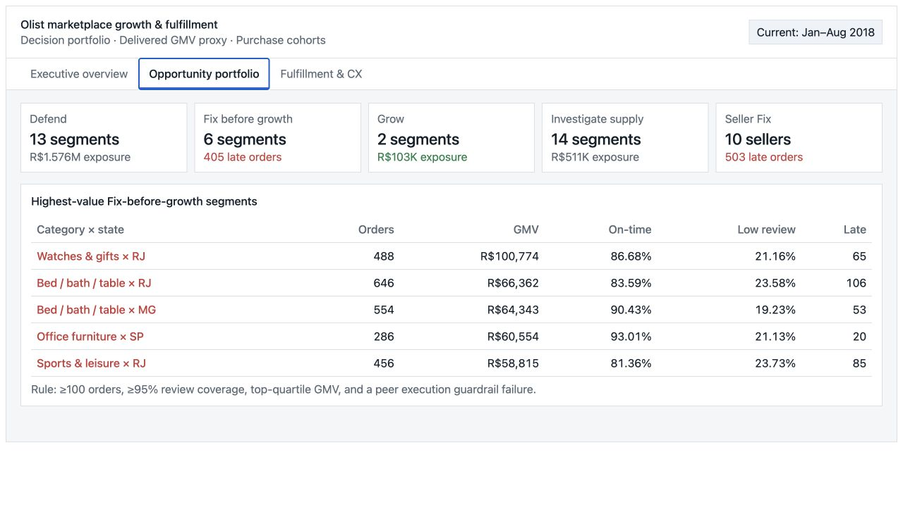
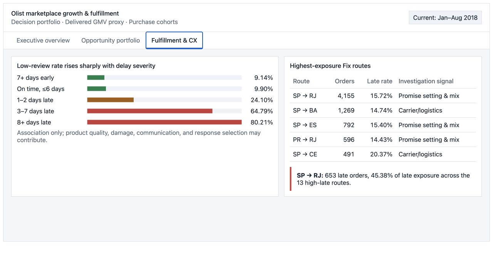

# Olist Marketplace Growth & Fulfillment Prioritization


> A decision-science and analytics-engineering case study that turns nine operational e-commerce files into traceable marketplace priorities—without hiding grain, denominator, uncertainty, or one-to-many join risk.

## Research logic 🧭

### Analytical question

**Where should Olist allocate commercial and operational resources to grow marketplace value while protecting delivery reliability and customer experience?**

The analysis treats category × customer state × seller as the central allocation problem. Delivered item GMV is an observable marketplace sales-value proxy; it is not audited revenue, margin, or profit.

This is intentionally a **decision-science project rather than a machine-learning exercise**. The dataset has no treatment labels, complete cost model, marketing exposure, inventory availability, or carrier identity. Transparent measurement rules, diagnostic decomposition, peer benchmarks, and reproducible prioritization are therefore more defensible than an opaque predictive score.

### Study design

| Research stage | Question | Method | Main output |
|---|---|---|---|
| Data contract | What does each source row represent, and which relationships are safe? | Key, null, duplicate, timestamp, FK-coverage, and cardinality profiling | Source audit and ERD |
| Measurement validity | Which populations, dates, reviews, and denominators can support comparison? | Deterministic review selection, cohort rules, chronology checks, coverage thresholds | Reusable measurement foundations |
| Marketplace baseline | How did scale and operating quality change? | Matched Jan–Aug cohorts, trend analysis, symmetric GMV decomposition | Volume versus AOV/mix evidence |
| Diagnostic segmentation | Where are value and fulfillment risk concentrated? | Category-state, seller, route, delay-band, concentration, and peer diagnostics | Opportunity and root-cause evidence |
| Decision system | Which segments qualify for Grow, Defend, Fix, or Investigate? | Ordered eligibility rules with impact, operating health, and confidence kept separate | Prioritized portfolios |
| Verification | Can every headline be reproduced independently? | Grain checks, partition tests, parent-total reconciliation, and second-path validation | Auditable findings and dashboard exports |

The full logic is documented in the [analytics framework](docs/ANALYTICS_FRAMEWORK.md), [hypothesis register](docs/HYPOTHESIS_REGISTER.md), and [analysis workplan](docs/ANALYSIS_WORKPLAN.md).

## Data architecture 🏗️



### Layer responsibilities

| Layer | Contract | Why it exists |
|---|---|---|
| `raw` | One source-shaped table per CSV; values land as text; source exceptions remain visible | Prevents silent type coercion and preserves reloadability |
| `staging` | Typed tables with explicit keys, FKs, null treatment, timestamps, and numeric precision | Converts files into a testable relational model |
| `analytics` foundations | One selected review per order; one row per order, item, customer, or rule record | Prevents payment, review, and item fanout |
| `analytics` diagnostics | One row per declared category-state, seller, route, or timing band | Aligns every metric with a decision grain |
| Dashboard exports | Small aggregate tables that preserve their upstream grain | Keeps BI tools from rebuilding unsafe joins |

The detailed lineage, grain contracts, and fanout controls are in [Data architecture](docs/DATA_ARCHITECTURE.md), [PostgreSQL schema design](docs/SCHEMA_DESIGN.md), and the [source ERD](docs/ERD_SOURCE.md).

## Measurement and validation 🔬

### Grain contract

| Analytical object | One row represents | Main protection |
|---|---|---|
| `order_measurement_base` | One `order_id` | Items and payments are aggregated before joining; reviews are deterministically selected |
| `item_measurement_base` | One `(order_id, order_item_id)` | Order outcomes may repeat, so distinct-order metrics are never summed across item segments |
| `customer_measurement_base` | One `customer_unique_id` | Repeat behavior uses the persistent customer identifier and equal follow-up logic |
| `category_state_diagnostic` | One category × customer state | Demand evidence is aggregated before seller-supply evidence joins |
| `seller_portfolio_diagnostic` | One seller | Handling metrics use valid single-seller orders for primary attribution |
| `route_fulfillment_diagnostic` | One seller state → customer state | Route totals reconcile to the delivered-order parent population |

### Core analytical controls

- **Comparable periods:** January–August 2017 versus January–August 2018; sparse partial months are excluded.
- **Review selection:** latest answered review per order, with deterministic timestamp and ID tie-breakers.
- **Rate eligibility:** at least 100 eligible orders; headline review comparisons additionally require at least 95% review coverage.
- **Fanout prevention:** item, payment, and review children become one row per target key before order-level joins.
- **Transparent prioritization:** peer-percentile and eligibility rules replace a hidden weighted score.
- **Independent validation:** resume-level numbers are rebuilt through a separate query path before publication.
- **Causal discipline:** observed associations support diagnosis and experiments, not claims of causal impact.

Metric populations, formulas, numerators, denominators, exclusions, and limitations are defined in the [metric dictionary](docs/METRIC_DICTIONARY.md).

## SQL research pipeline 💻

The repository contains 19 dependency-ordered PostgreSQL scripts:

```text
01–03  schemas and source-shaped / typed tables
04–06  raw and staging quality gates
07–09  measurement rules, foundations, and reconciliation
10–11  marketplace baseline and symmetric GMV decomposition
12–13  category-state, seller, route, and CX diagnostics
14–15  rule-based priority portfolios and eligibility checks
16     independent reconstruction of headline findings
17–19  dashboard views, reconciliation, and aggregate exports
```

Techniques include CTEs, window functions, deterministic ranking, filtered aggregates, cohort logic, contribution analysis, symmetric/Shapley decomposition, percentile benchmarks, HHI concentration, scenario sizing, and multi-path reconciliation. See the [SQL execution guide](sql/README.md) for object dependencies and output grains.

## Verified research outcomes 📊

| Finding | Evidence | Interpretation |
|---|---|---|
| Growth was volume-led | Jan–Aug delivered GMV proxy increased from R$2.99M to R$7.22M (+141.13%); 99.40% of the change is allocated to order volume | Commercial expansion needs fulfillment capacity and quality controls |
| Operating quality weakened as scale grew | On-time delivery fell from 96.50% to 92.27%; low-review rate rose from 10.59% to 13.37% | Growth should be monitored with delivery and CX guardrails |
| Six material markets qualify for Fix before growth | 2,920 orders, R$409K GMV exposure, 405 late orders, and a 210-order peer-median arithmetic gap | Investigate seller, route, and promise-setting mechanisms before further demand activation |
| Route risk is concentrated | Thirteen high-late routes contain 1,439 late orders; SP → RJ contributes 653 at a 15.72% late rate | Route-level diagnosis should begin with SP → RJ |
| Severe delay is associated with poor reviews | Low-review rate is 9.90% near on-time, 64.79% at 3–7 days late, and 80.21% at 8+ days late | Test prevention and recovery interventions; do not infer causality |

All headline evidence is independently reproduced by [`16_headline_validation.sql`](sql/16_headline_validation.sql).

## Decision portfolios 🎯

| Posture | Qualified population | Current exposure |
|---|---:|---:|
| Defend | 13 category-state segments / 12,561 orders | R$1.576M GMV exposure |
| Fix before growth | 6 segments / 2,920 orders | R$409K GMV exposure |
| Grow | 2 segments / 1,019 orders | R$103K GMV exposure |
| Investigate supply | 14 segments / 3,385 orders | R$511K GMV exposure |
| Seller Fix | 10 sellers / 4,508 orders | R$790K GMV exposure |

“Exposure” is observable current-period GMV inside a decision segment. It is not forecast uplift, avoidable loss, audited revenue, or profit. The operating sequence is detailed in the [executive summary](docs/EXECUTIVE_SUMMARY.md), [prioritization results](docs/PRIORITIZATION_RESULTS.md), and [recommendations](docs/RECOMMENDATIONS.md).

## Dashboard delivery 📈

The packaged [Tableau workbook](tableau/Olist_Marketplace_Portfolio.twbx) is the primary native visual deliverable. Its sources remain separate by grain and display:

1. top category contributors to matched-period GMV change;
2. Fix category-state GMV exposure;
3. Fix routes ranked by late orders;
4. delivery timing versus low-review rate.



Three static, recruiter-facing dashboard views and optional Power BI build assets are also included:

<p align="center">
  
  
  
</p>

## Reproduce the study 🛠️

1. Install PostgreSQL and create an empty database named `olist_portfolio`.
2. Download the public Olist dataset and place the nine unchanged CSV files in `data/raw/`.
3. Run scripts `01`–`03`, then import the nine files into their matching `raw.*` tables.
4. Run scripts `04`–`19` in numeric order, stopping whenever a reconciliation gate fails.
5. Compare the outputs with the documented validation totals before interpreting results.
6. Open the packaged Tableau workbook or load the seven aggregate tables from `dashboard/data/`.

Raw CSV files are intentionally Git-ignored and are not redistributed. The [raw-data instructions](data/raw/README.md) and [SQL execution guide](sql/README.md) provide the detailed setup sequence.

## Repository map 🗂️

| Path | Purpose |
|---|---|
| [`sql/`](sql/) | Reproducible PostgreSQL pipeline and validation queries |
| [`docs/DATA_ARCHITECTURE.md`](docs/DATA_ARCHITECTURE.md) | End-to-end lineage, layers, grains, and validation gates |
| [`docs/ANALYTICS_FRAMEWORK.md`](docs/ANALYTICS_FRAMEWORK.md) | Decision tree, hypotheses, evidence tiers, and research standards |
| [`docs/METRIC_DICTIONARY.md`](docs/METRIC_DICTIONARY.md) | Populations, formulas, denominators, exclusions, and limitations |
| [`docs/OPPORTUNITY_DIAGNOSTICS.md`](docs/OPPORTUNITY_DIAGNOSTICS.md) | Category-state, seller, route, fulfillment, and review evidence |
| [`docs/PRIORITIZATION_RESULTS.md`](docs/PRIORITIZATION_RESULTS.md) | Explainable Grow / Defend / Fix / Investigate rules |
| [`dashboard/data/`](dashboard/data/) | Seven presentation-safe aggregate exports |
| [`tableau/`](tableau/) | Portable workbook, source extracts, and review guide |
| [`powerbi/`](powerbi/) | Optional model guide, DAX measures, and theme |
| [`docs/INTERVIEW_GUIDE.md`](docs/INTERVIEW_GUIDE.md) | Technical and business defense of the project |

## Limitations ⚠️

The dataset does not include commission revenue, product or inventory cost, margin, marketing exposure, seller acquisition cost, inventory availability, carrier identity, service-level contracts, complete returns/refunds, or experiment assignment. Results are observational and dataset-relative. Recommendations are proposed operating tests—not implemented business impact.

## Data source

[Brazilian E-Commerce Public Dataset by Olist](https://www.kaggle.com/datasets/olistbr/brazilian-ecommerce), cited under the dataset's listed CC BY-NC-SA 4.0 terms. Source CSVs remain local and immutable.

This portfolio is designed for Business Analyst, Business Operations, Sales Operations, Market Analysis, Analytics Engineering, and Logistics Analytics roles.
