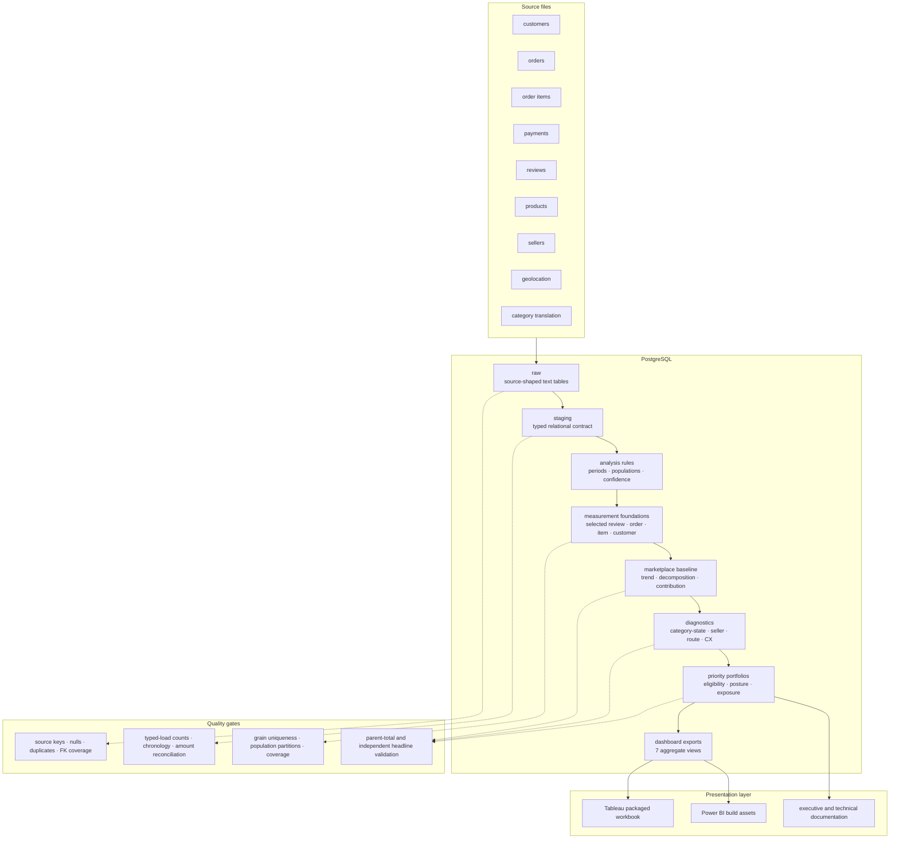
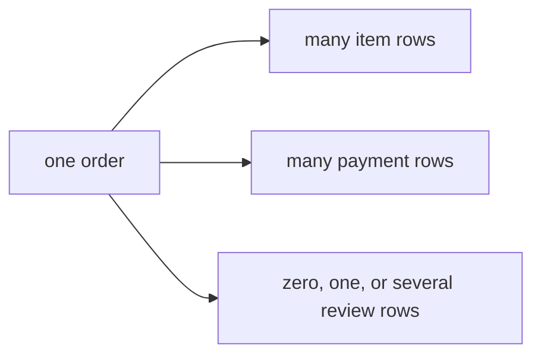

# Data architecture and analytical lineage

## Purpose

This document explains how the project converts nine public Olist CSV files into reproducible decision evidence. The architecture is designed around five principles:

1. preserve the source before cleaning it;
2. make type and quality decisions explicit;
3. declare the grain of every analytical object;
4. prevent one-to-many joins from multiplying business measures;
5. reconcile every published result to an independently verified parent total.

The result is an analytics pipeline, not a collection of disconnected queries.

## End-to-end lineage



## Layer design

### 1. Source and raw landing

The nine source files are immutable inputs. Each file lands in a matching `raw.*` table with its original column names and all values stored as `text`.

This choice is deliberate:

- malformed dates or amounts remain observable instead of failing silently during import;
- ZIP prefixes retain leading zeroes;
- source spelling and null patterns remain auditable;
- the raw layer can be dropped and reloaded without reproducing undocumented cleanup.

Raw tables have no relational constraints. Their first purpose is evidence preservation, not convenience.

### 2. Typed staging contract

The `staging` schema converts source strings into typed, constrained analysis inputs. It adds explicit primary keys, composite keys, foreign keys, timestamps, numeric precision, and nullable-field policy.

| Staging object | Declared grain | Key |
|---|---|---|
| `customers` | One source customer record | `customer_id` |
| `orders` | One order | `order_id` |
| `order_items` | One item line | `(order_id, order_item_id)` |
| `order_payments` | One payment sequence | `(order_id, payment_sequential)` |
| `order_reviews` | One review-order association | `(review_id, order_id)` |
| `products` | One product | `product_id` |
| `sellers` | One seller | `seller_id` |
| `category_translation` | One Portuguese category label | `product_category_name` |
| `geolocation_observations` | One source geolocation observation | Generated technical key |

The typed load is atomic: all transforms succeed, or the transaction rolls back. Row counts and major monetary totals reconcile between raw and staging before analytics objects are built.

### 3. Measurement foundations

The foundation layer resolves analytical ambiguity once and reuses the result downstream.

| Foundation | Grain | Resolved decision |
|---|---|---|
| Analysis rules | One row | Stable date window, matched comparison periods, confidence thresholds, and coverage rules |
| Selected review | One row per `order_id` | Latest answered review with deterministic timestamp and ID tie-breakers |
| Order measurement base | One row per `order_id` | Status, customer, item/payment aggregates, delivery intervals, selected review, and validity flags |
| Item measurement base | One row per `(order_id, order_item_id)` | Category, seller, customer state, delivered value, freight, and repeated order outcomes |
| Customer measurement base | One row per `customer_unique_id` | First purchase, delivered-order count, value, and equal-window repeat evidence |

This design prevents separate queries from redefining “delivered,” “late,” “reviewed,” or “current period” differently.

### 4. Diagnostic and decision views

Diagnostic views aggregate a foundation to one decision grain before adding peer or supply context.

| View family | Grain | Decision supported |
|---|---|---|
| Marketplace period/month | Period or purchase month | Scale, quality trend, and comparable-period baseline |
| Category growth contribution | Category | Product-family contribution to marketplace change |
| State growth contribution | Customer state | Geographic contribution to marketplace change |
| Category-state diagnostic | Category × customer state | Demand attractiveness, operating health, and supply depth |
| Seller diagnostic | Seller | Value, growth, execution, concentration, and improvement eligibility |
| Route diagnostic | Seller state → customer state | Late-order concentration and handling/carrier signals |
| Delay-band diagnostic | Mutually exclusive delivery-timing band | Observed association between delivery timing and low reviews |

Priority views apply ordered rules to these diagnostics. Impact, operating health, and evidence confidence remain separate columns; the system does not collapse them into an opaque weighted score.

### 5. Presentation-safe exports

Seven `analytics.dashboard_*` views provide small, portable datasets for Tableau and Power BI. Each export preserves one upstream grain. Cross-source relationships are intentionally avoided in Tableau because a category row, route row, and delay-band row do not represent the same analytical unit.

## Fanout control

Olist contains several one-to-many relationships:



Joining all children directly would produce item × payment × review combinations and overstate GMV, payment value, freight, order counts, and review outcomes.

The safe order-level path is:

```text
items    → aggregate to one row per order ┐
payments → aggregate to one row per order ├→ join to one-row-per-order base
reviews  → select one row per order       ┘
```

For category or seller analysis, the project begins at item grain and attaches already-defined order outcomes. Distinct-order measures across overlapping item segments are explicitly non-additive.

Raw geolocation is also isolated: 1,000,163 observations represent only 19,015 ZIP prefixes and include extensive duplicates. State-level route analysis is used instead of joining geolocation observations directly.

## Measurement contract

Every headline metric carries five pieces of metadata:

- analytical population;
- output grain;
- numerator and denominator;
- exclusion and anomaly policy;
- independent validation path.

Examples:

| Metric | Population and denominator | Important limitation |
|---|---|---|
| Delivered GMV proxy | Sum of item price for delivered, item-bearing orders | Marketplace value proxy; not Olist revenue or profit |
| On-time rate | On-time-eligible delivered orders | Requires valid actual and estimated delivery dates |
| Low-review rate | Selected reviews scored 1–2 / selected reviewed orders | Denominator is reviewed orders, not all delivered orders |
| Current GMV exposure | Delivered GMV inside a qualified posture | Not forecast uplift, preventable loss, or margin |
| Peer-median late-order gap | Eligible orders × positive peer on-time gap | Arithmetic scenario, not a causal forecast |

The complete definitions are in [METRIC_DICTIONARY.md](METRIC_DICTIONARY.md).

## Validation gates

| Gate | Tests | Failure response |
|---|---|---|
| Source audit | File count, schema, key uniqueness, duplicate pattern, nulls, timestamps, FK coverage | Stop before DDL assumptions are finalized |
| Raw import | Row counts, status values, type-readiness, one-to-many relationships | Correct import or document source exception |
| Staging | Key/FK integrity, typed ranges, chronology, row and amount reconciliation | Roll back or fix the typed transform |
| Foundations | One-row-per-key uniqueness, population partitions, duration validity, review selection | Fix measurement rules before analysis |
| Diagnostics | Parent-total allocation, denominator coverage, peer eligibility | Do not interpret unreconciled segments |
| Portfolios | Zero ineligible ranked rows, mutually exclusive posture allocation, visible rule inputs | Correct rule order or qualification logic |
| Publication | Independent headline rebuild, dashboard-export reconciliation, credential and raw-data scan | Block release until all checks pass |

## Result lineage

| Published result | Primary analytical path | Independent check |
|---|---|---|
| Matched-period GMV and quality baseline | `order_measurement_base` + `item_measurement_base` → marketplace period views | `11_marketplace_baseline_reconciliation.sql` and `16_headline_validation.sql` |
| Volume versus AOV/mix decomposition | Marketplace period totals → symmetric interaction allocation | Components must reconstruct observed GMV change exactly |
| Category and state growth contribution | Mutually exclusive item/customer-state allocations | Segment changes must sum to marketplace change |
| Fix category-state portfolio | Category-state diagnostic → ordered posture rules | Eligibility, GMV allocation, and peer-gap checks in scripts `15` and `16` |
| Fix route portfolio | Route diagnostic → high-late route rule | Route populations and late orders reconcile to delivered-order evidence |
| Delay-review relationship | Valid delivered orders → mutually exclusive timing bands | Band counts partition the eligible reviewed population |

## Reproducibility boundary

The repository contains executable SQL, aggregate dashboard outputs, documentation, and the packaged Tableau workbook. Raw Olist files remain local and Git-ignored. A reproducible run therefore requires downloading the cited dataset, loading the nine raw tables, and executing the numbered SQL pipeline in order.

See [sql/README.md](../sql/README.md) for the execution sequence and [DATA_AUDIT.md](DATA_AUDIT.md) for source-level evidence.
