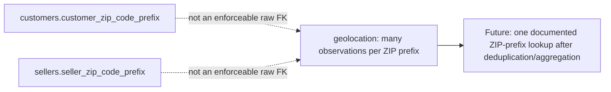

# Source relationship map (Stage 2A)

This map describes the raw CSV relationships before PostgreSQL tables exist. Solid operational links have complete non-null child-key coverage in the source. The location links are shown separately because raw geolocation has repeated ZIP-prefix observations and is not safe to join directly.

```mermaid
erDiagram
    CUSTOMERS ||--|| ORDERS : "customer_id (one-to-one in extract)"
    ORDERS ||--o{ ORDER_ITEMS : "order_id"
    PRODUCTS ||--o{ ORDER_ITEMS : "product_id"
    SELLERS ||--o{ ORDER_ITEMS : "seller_id"
    ORDERS ||--o{ ORDER_PAYMENTS : "order_id"
    ORDERS ||--o{ ORDER_REVIEWS : "order_id"
    CATEGORY_TRANSLATION o|--o{ PRODUCTS : "product_category_name (incomplete mapping)"

    CUSTOMERS {
        text customer_id PK
        text customer_unique_id
        text customer_zip_code_prefix
    }
    ORDERS {
        text order_id PK
        text customer_id FK
        text order_status
        timestamp order_purchase_timestamp
    }
    ORDER_ITEMS {
        text order_id PK_FK
        integer order_item_id PK
        text product_id FK
        text seller_id FK
        numeric price
        numeric freight_value
    }
    ORDER_PAYMENTS {
        text order_id PK_FK
        integer payment_sequential PK
        text payment_type
        numeric payment_value
    }
    ORDER_REVIEWS {
        text review_id PK_PART
        text order_id PK_PART_FK
        integer review_score
    }
    PRODUCTS {
        text product_id PK
        text product_category_name
    }
    SELLERS {
        text seller_id PK
        text seller_zip_code_prefix
    }
    CATEGORY_TRANSLATION {
        text product_category_name PK
        text product_category_name_english
    }
```

## How to read this map

- `PK` marks a candidate source key that was unique in the Stage 2A profile. `PK_PART` means a column is only unique when combined with the other marked key column.
- `FK` marks a tested source relationship, not a database constraint—no tables or constraints have been created yet.
- `||--o{` means one parent can relate to zero or many child rows. An order can have many items, payments, or reviews.
- `CUSTOMERS ||--|| ORDERS` is one-to-one **in this extract** because both `customer_id` columns are unique. It does not mean a person can only buy once: `customer_unique_id` repeats across 3,345 customer rows and is the field for repeat-buyer analysis.
- Reviews are unusual: `review_id` alone repeats across orders, and `order_id` alone can have several review rows. The composite (`review_id`, `order_id`) is unique in the source profile.
- The translation relationship is optional/incomplete. Two non-null Portuguese category values are not present in the 71-row translation file; use a left join when preserving all products.

## Geolocation: separate staging requirement



The raw geolocation CSV contains 1,000,163 observations but only 19,015 distinct ZIP prefixes, including 261,831 exact full-row duplicates. Joining it at raw grain would multiply customer or seller rows. Postal-prefix fields should be treated as text so leading zeroes remain intact.

## Safe analysis paths

To answer an **order-level** question, start with `orders`, aggregate each needed child table to one row per `order_id`, then join the summaries. To answer an **item-level** question—such as category × customer state × seller—start at `order_items`, because each result row naturally represents one item line. Adding payments or reviews requires an order-level pre-aggregation first so that multiple payment/review rows do not multiply an item’s price or freight.
